# AI Coding Agent Proxy

Run terminal coding agents (Claude Code, GitHub Copilot CLI, OpenAI Codex, Qwen Code, OpenCode, Aider, Goose) through one local proxy and see everything they do: every model call with its prompt, reply, tokens and timing, and, for agents signed in to their own accounts, every other request they make as well: sign-in, settings, MCP, telemetry and update checks.

It supports three setups, and you can mix them:

- **Your accounts.** Claude Code on your claude.ai login, Copilot CLI on your GitHub Copilot subscription, Codex on your ChatGPT plan. Nothing changes about how the agent works; the proxy records its HTTPS traffic in transit.
- **Local models.** Any agent against your own Ollama machines. The proxy translates each request to Ollama's native API and applies tuned settings, so local Qwen models get the context window and sampling they need.
- **Hosted API pass-through.** Claude Code pointed at the proxy's Anthropic endpoint, forwarded unchanged to the Anthropic API.

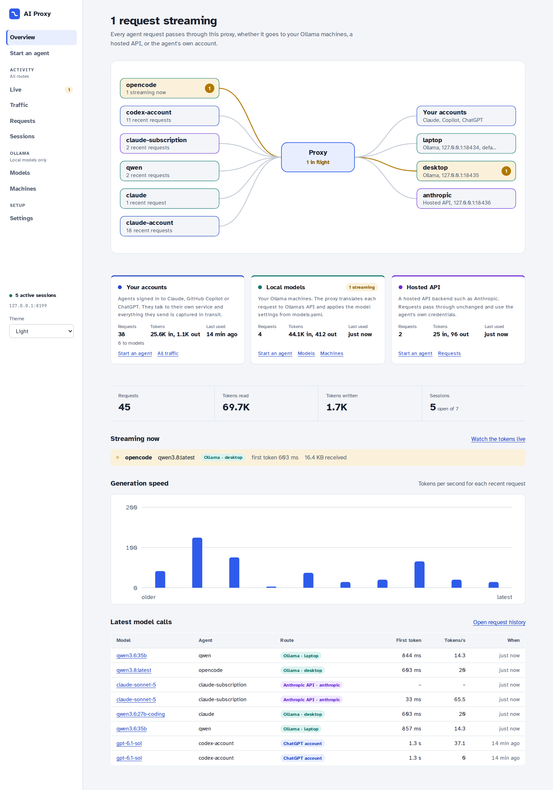

**Contents:** [Quick start](#quick-start) · [The three setups](#the-three-setups) · [Your accounts](#setup-1-your-accounts-claude-copilot-chatgpt) · [Local models](#setup-2-local-models-on-ollama) · [Hosted API](#setup-3-hosted-api-pass-through) · [Supported agents](#supported-agents) · [What the requests are](#what-the-requests-are) · [The console](#the-console) · [Configuration](#configuration) · [API](#api) · [Development](#development)

## Quick start

You need Python 3.11+ and Node 20+, plus whichever of these you want to use: a Claude, GitHub Copilot or ChatGPT subscription, or an Ollama server.

```bash
python -m venv .venv
. .venv/bin/activate            # Windows: .venv\Scripts\activate
pip install -e "./proxy[dev]"

agent-proxy                     # console on http://127.0.0.1:8181
```

`agent-proxy` builds the web console from `ui/` on first start, and rebuilds it whenever the UI sources are newer than `ui/dist` (running `npm install` first if dependencies changed). If the build fails it prints npm's output and serves the previous build. Use `agent-proxy --no-build` or `AI_PROXY_UI_BUILD=0` to skip this.

Then start an agent from your project folder:

```bash
agent --list                                # configured agents and whether they're installed
agent claude-account .                      # Claude Code on your claude.ai login, everything captured
agent copilot-account .                     # Copilot CLI on your GitHub subscription
agent codex-account .                       # Codex on your ChatGPT plan
agent qwen . --model qwen3.6:35b            # Qwen Code on your default Ollama machine
agent opencode . --model qwen3.8:latest --backend desktop --trace
agent claude-subscription . --model sonnet  # Claude Code via the hosted Anthropic pass-through
```

The launcher starts the proxy if it isn't running and opens a session for the run. It sets the agent's environment, waits for it to exit, then records the exit status. Arguments after `--` go to the agent (`agent claude-account . -- --model sonnet`), and `--trace` saves full request and response bodies.

## The three setups

| | Your accounts | Local models | Hosted API |
|---|---|---|---|
| **Agents** | `claude-account`, `copilot-account`, `codex-account` | `qwen`, `opencode`, `claude`, `copilot`, `codex`, `aider`, `goose` | `claude-subscription` |
| **Model** | The vendor's, on your plan | Your Ollama machines | Anthropic's, via an `anthropic` backend |
| **How the agent reaches the proxy** | `HTTPS_PROXY` to the intercept listener (`:8183`) | Its API base URL points at a proxy endpoint | `ANTHROPIC_BASE_URL` points at the proxy |
| **What the proxy does** | Decrypts, records, forwards unchanged | Translates to Ollama's API, applies `models.yaml` | Forwards unchanged |
| **What you see** | Every request, to any host: model calls plus sign-in, settings, MCP, telemetry | Model calls, with the exact payload sent to Ollama | Model calls and other Claude Code API calls |
| **Credentials** | The agent's own login | None needed | The agent's own login |

```text
Your accounts   Claude Code ─┐                           ┌─▶ api.anthropic.com, mcp-proxy.anthropic.com, ...
                Copilot CLI ─┼─ HTTPS_PROXY ─▶ intercept ─┼─▶ api.githubcopilot.com, api.github.com, ...
                Codex       ─┘    :8183        listener   └─▶ chatgpt.com (HTTPS and WebSocket), ...

Local models    Qwen Code, OpenCode, ─▶ /session/<id>/v1 ─────▶ translate + tune ─▶ laptop  (Ollama)
                Claude Code, Aider ...  /session/<id>/anthropic                   └▶ desktop (Ollama)

Hosted API      Claude Code ─▶ /session/<id>/anthropic ─────────▶ api.anthropic.com
```

The console colours every request, session and agent by its route: **blue** for your accounts, **teal** for local models, **purple** for the hosted API.

## Setup 1: Your accounts (Claude, Copilot, ChatGPT)

Sign in once with the agent's own client (`claude`, `copilot` then `/login`, or `codex login`). Then:

```bash
agent claude-account .
agent copilot-account .
agent codex-account .
agent claude-account . --trace -- --model sonnet   # save bodies; pass a model to the agent
```

So that the account login is the one used, unset `ANTHROPIC_API_KEY`, `ANTHROPIC_AUTH_TOKEN`, `ANTHROPIC_BASE_URL`, `COPILOT_PROVIDER_*`, `COPILOT_OFFLINE`, `OPENAI_API_KEY` and `OPENAI_BASE_URL`, and remove any Claude `apiKeyHelper`. Your plan's usage limits still apply.

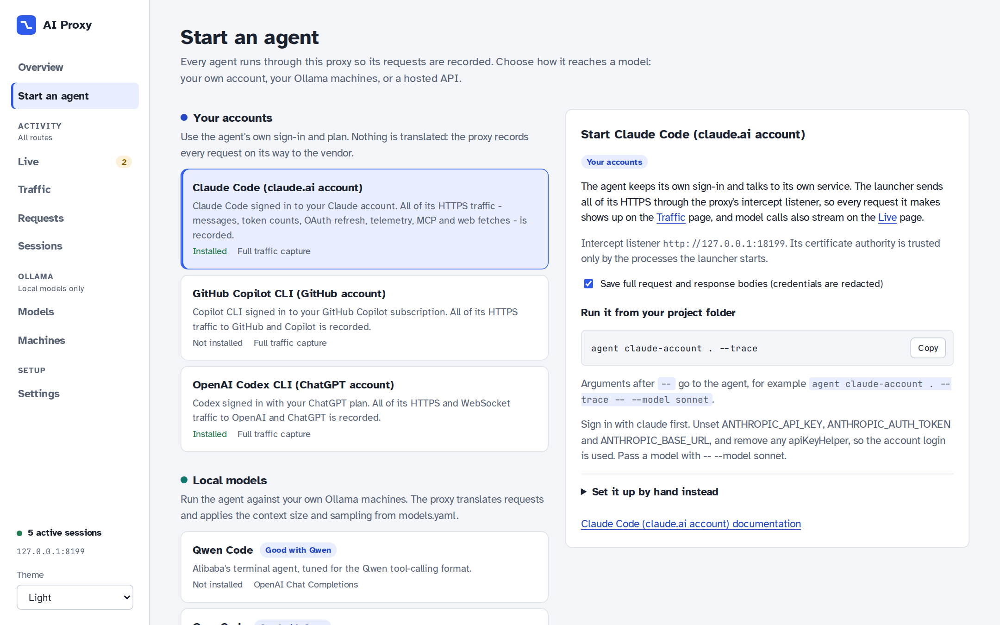

### How the capture works

- The proxy runs a second listener, the **intercept listener** (`intercept` in `config/backends.yaml`, default `127.0.0.1:8183`). The launcher starts the agent with `HTTPS_PROXY` pointing at it, with the session id as the proxy URL's user name, so every request is filed under the right session.
- On first start the proxy creates a local certificate authority in `certs/`. The launcher hands it only to the agent's own process tree: `NODE_EXTRA_CA_CERTS` for Claude Code and Copilot CLI, `CODEX_CA_CERTIFICATE` for Codex, and `SSL_CERT_FILE`, `REQUESTS_CA_BUNDLE`, `CURL_CA_BUNDLE` and `GIT_SSL_CAINFO` pointing at a bundle of your system roots plus that CA. That last set means the tools the agent runs (curl, git, pip, Go-based MCP servers) keep working and are captured too. Nothing is added to the system trust store.
- For each request, the proxy terminates TLS with a certificate from that CA, forwards the request unchanged over a normally verified TLS connection, and streams the reply straight back. Model calls are parsed as they stream, giving tokens, prompt-cache reads and writes, time to first token, and reasoning, text and tool calls.
- **WebSockets** are relayed byte for byte and logged as a connection. Their messages are also decoded on the side: Codex sends its model turns over a WebSocket to `chatgpt.com/backend-api/codex/responses`, and each `response.create` becomes its own model-call record. The proxy drops `Sec-WebSocket-Extensions` from the upgrade so messages aren't compressed.
- Hosts listed under `intercept.passthrough` are tunnelled without decryption and logged as connections only.

### Agent-specific notes

- **Codex** runs with `--no-daemon`. Without it, the interactive TUI hands conversations to Codex's shared background app-server daemon, which was started without the proxy settings, so only startup calls would be captured. Each Codex conversation also opens with a *prewarm* turn (`generate: false`) that shows up as a model call with no output.
- **Codex** may print `[UNDICI-EHPA] Warning: EnvHttpProxyAgent is experimental` from its Node launcher when it picks up the proxy settings. It's harmless.
- **VS Code extensions** (Copilot, ChatGPT/Codex) run their own processes and aren't captured. Only agents started with `agent ...` go through the proxy.

### Privacy and security

- **Redaction.** Credentials are removed before anything is shown or saved: `Authorization`, `Cookie`, `Set-Cookie` and any header with *auth*, *token*, *secret*, *key* or *session* in its name; token-like query parameters; and token fields (`access_token`, `refresh_token`, `code`, ...) in bodies of OAuth and token endpoints.
- **Bodies are not redacted.** Saved and live bodies still contain your code and prompts. Bodies are saved only for sessions with capture on (`--trace`, or the switch on **Sessions**). Live text is held in memory only.
- **Keep the listener on loopback.** Anyone who can reach the intercept listener can use it as a proxy, and the console has no authentication.
- **The CA key.** `certs/ca-key.pem` is created readable only by you. Delete `certs/` to rotate the CA.
- **No credential handling.** The proxy never reads credentials from disk or asks you to copy tokens; the agents keep managing their own sign-in and refresh.

## Setup 2: Local models on Ollama

Point any agent at your Ollama machines. Configure them as `type: ollama` backends in `config/backends.yaml` (or on **Settings**), then:

```bash
agent qwen . --model qwen3.6:35b                         # default backend
agent opencode . --model qwen3.8:latest --backend desktop
agent claude . --model qwen3.6:27b-coding -- --continue  # Claude Code, translated to Ollama
```

The **Start an agent** page builds the same commands. For Ollama agents it lists only Ollama machines and the models each one has.

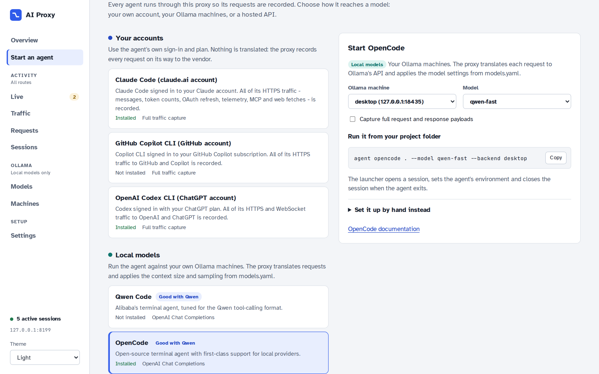

### Tuning Ollama for Qwen

Ollama's OpenAI-compatible `/v1` endpoint ignores per-request settings such as `num_ctx`, so agent conversations get silently truncated to the server's default context. To avoid that, the proxy translates OpenAI Chat and Anthropic requests to Ollama's native `/api/chat`, applies the matching profile from [`config/models.yaml`](config/models.yaml), and translates the reply back, including streaming, tool calls and reasoning.

```yaml
defaults:
  keep_alive: 30m          # keep models warm between agent turns
  options:
    num_ctx: 65536         # context for every model

profiles:                  # first match wins, matched against the Ollama tag
  - name: qwen-coder
    match: ["qwen3*coder*", "qwen3*coding*"]
    options: {temperature: 0.7, top_p: 0.8, top_k: 20, repeat_penalty: 1.05}
  - name: qwen3
    match: ["qwen3*"]      # qwen3, qwen3.5, qwen3.6, qwen3.8 ...
    options: {temperature: 0.6, top_p: 0.95, top_k: 20, min_p: 0}

models:                    # aliases agents can use
  qwen-fast:
    ollama_model: qwen3.6:35b
    think: false           # skip reasoning for quick edit loops
```

Values a client sends explicitly always override profile defaults. The **Ollama models** page lists every model on each machine with the settings the proxy will apply, and how much of each loaded model fits in VRAM.

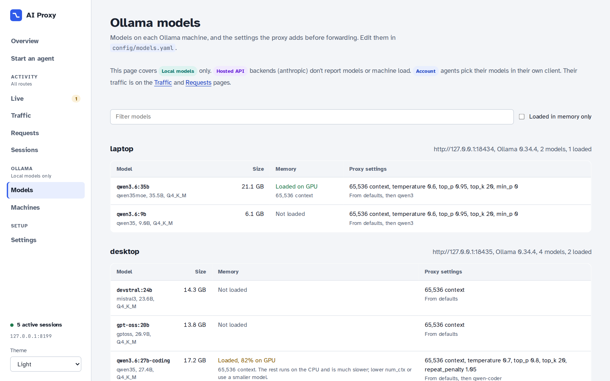

If a model shows **less than 100% on GPU**, part of it runs on the CPU and generation slows down a lot. Fix it by doing one of the following:

- lowering `num_ctx` in `defaults` or in a profile;
- picking a smaller tag;
- starting Ollama with a quantized KV cache: `OLLAMA_FLASH_ATTENTION=1 OLLAMA_KV_CACHE_TYPE=q8_0` (see [`scripts/start-ollama.sh`](scripts/start-ollama.sh)).

Codex in `--oss` mode uses the Responses API, which is passed through unchanged; set `OLLAMA_CONTEXT_LENGTH` on the server for it.

### Which agent works best with Qwen on Ollama

1. **Qwen Code** is the first choice for Qwen 3.x. It's built by the Qwen team around the tool-calling format the models are trained on, so tool calls parse reliably.
2. **OpenCode** is a close second. It has good local-provider support and a smaller system prompt than Claude Code, which matters with 27–35B models.
3. **Copilot CLI** (BYOK mode) and **Claude Code** work too. Claude Code's large system prompt and tool list need a 64K+ context and are slower to process on local GPUs.

This ranking is a recommendation, not a measured benchmark. Use `agent-benchmark` and the Requests page to compare agents on your own hardware.

### Watching the Ollama machines

The **Ollama machines** page shows what each machine has loaded, like `ollama ps`: size, GPU/CPU split, context length and when the model unloads. It also shows in-flight requests and recent speed, and charts CPU, memory, GPU load and GPU memory over the last five minutes. Machines start collapsed; only the ones you expand are contacted, every two seconds. Samples aren't saved.

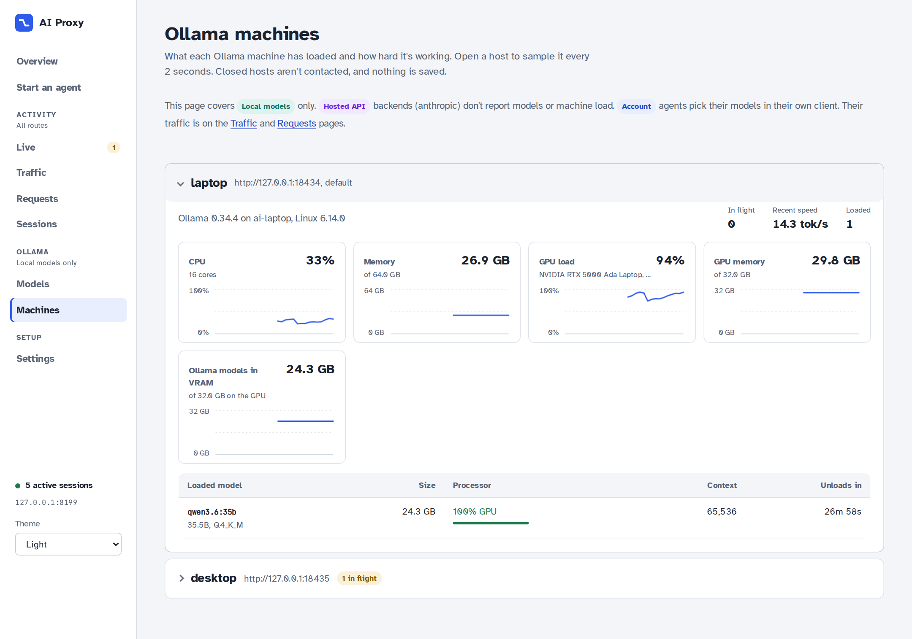

Loaded models come from Ollama's API, so they work for remote machines too. CPU and GPU load need a process on the machine itself:

- **On the proxy's own machine**, metrics are collected automatically. GPU figures need `nvidia-smi`.
- **On a remote machine**, install the proxy package there and run `agent-metrics` (port 8182). Then set that backend's **Metrics URL** in Settings, for example `http://192.168.1.133:8182`.

## Setup 3: Hosted API pass-through

The `claude-subscription` agent sets only `ANTHROPIC_BASE_URL`, pointing at the proxy's Anthropic endpoint. The proxy forwards everything unchanged to a `type: anthropic` backend (the bundled `anthropic` backend is `https://api.anthropic.com`). Claude Code keeps its own login.

```bash
agent claude-subscription . --model sonnet
```

The launcher picks the `anthropic` backend automatically. The proxy sees Claude Code's API calls (`/v1/messages`, `count_tokens`, `/v1/models` and any other `/anthropic/...` path) but not its OAuth, telemetry or MCP traffic, which goes directly to Anthropic. Use `claude-account` when you want those too.

## Supported agents

| Agent | Command | Route | How it talks to the proxy | Install |
|---|---|---|---|---|
| Claude Code (claude.ai account) | `agent claude-account` | Your accounts | All HTTPS through the intercept listener | `npm i -g @anthropic-ai/claude-code` |
| GitHub Copilot CLI (GitHub account) | `agent copilot-account` | Your accounts | All HTTPS through the intercept listener | `npm i -g @github/copilot` |
| OpenAI Codex CLI (ChatGPT account) | `agent codex-account` | Your accounts | All HTTPS and WebSocket traffic through the intercept listener | `npm i -g @openai/codex` |
| Qwen Code | `agent qwen` | Local models | OpenAI Chat, translated to native Ollama | `npm i -g @qwen-code/qwen-code` |
| OpenCode | `agent opencode` | Local models | OpenAI Chat, translated to native Ollama | `npm i -g opencode-ai` |
| Claude Code (Ollama) | `agent claude` | Local models | Anthropic Messages, translated to native Ollama | `npm i -g @anthropic-ai/claude-code` |
| GitHub Copilot CLI (Ollama, BYOK) | `agent copilot` | Local models | OpenAI Chat, offline BYOK mode | `npm i -g @github/copilot` |
| OpenAI Codex CLI (Ollama) | `agent codex` | Local models | OpenAI Responses, passed through | `npm i -g @openai/codex` |
| Aider | `agent aider` | Local models | Native Ollama | `aider-install` |
| Goose | `agent goose` | Local models | Native Ollama | see the Goose docs |
| Claude Code (Anthropic API pass-through) | `agent claude-subscription` | Hosted API | Anthropic Messages, passed through | `npm i -g @anthropic-ai/claude-code` |

Agents are defined in [`config/agents.yaml`](config/agents.yaml) as environment variables and arguments with placeholders such as `{openai_url}`, `{anthropic_url}` and `{model}`; adding an agent needs no code changes. Set `intercept: true` for an agent that should keep its own login and be captured in transit (`--model` then becomes optional), or `backend_type: anthropic` for one that needs a hosted backend. The **Start an agent** page shows each agent's install state, builds its launch command, and can open a session and print the environment for running the agent by hand in bash or PowerShell.

## What the requests are

Every request is recorded with timing, sizes and status, and labelled with **the service it went to** and **what it was for**. Model calls are what you'd expect. The rest is what agents do around them, and it's usually most of the traffic: in one capture, Claude Code made 43 requests to answer a single one-line prompt, and only one of them was a model call.

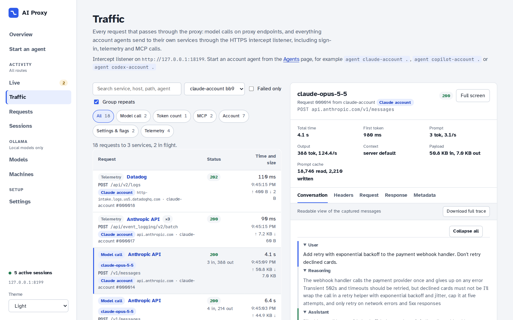

### Request types

| Type | What it is | Examples |
|---|---|---|
| **Model call** | A prompt sent to a model, with its streamed reply. Recorded with input/output tokens, prompt-cache reads and writes, time to first token and generation speed. | `POST api.anthropic.com/v1/messages`, `POST api.individual.githubcopilot.com/v1/messages`, `WS chatgpt.com/backend-api/codex/responses`, `/v1/chat/completions` to Ollama |
| **Token count** | Asks how many tokens a prompt would use, without running it. Claude Code calls this before long turns. | `POST /v1/messages/count_tokens` |
| **Model list** | Which models the account or machine offers. | `GET api.individual.githubcopilot.com/models`, `GET chatgpt.com/backend-api/codex/models` |
| **MCP** | Model Context Protocol servers and tool registries the agent connects to: tool lists and tool calls. | `POST mcp-proxy.anthropic.com/v1/mcp/...`, `GET api.anthropic.com/mcp-registry/v0/servers`, `POST api.individual.githubcopilot.com/mcp/readonly`, `chatgpt.com/backend-api/ps/plugins/...` |
| **Account** | Who you are, your plan and organisation settings. Some are polled repeatedly. | `api.anthropic.com/api/oauth/organizations/...`, `api.github.com/copilot_internal/user`, `chatgpt.com/backend-api/wham/...` |
| **Sign-in** | Token validation and refresh. Token values are redacted. | `POST api.anthropic.com/api/oauth/validate`, `api.github.com/copilot_internal/v2/token` |
| **Settings & flags** | Feature flags, managed policy and bootstrap configuration. | `api.anthropic.com/api/claude_cli/bootstrap`, `/api/claude_code/policy_limits`, `/api/eval/...` |
| **Telemetry** | Usage events, metrics and logs the agent reports. | `api.anthropic.com/api/event_logging/v2/batch`, `http-intake.logs.*.datadoghq.com`, `telemetry.individual.githubcopilot.com`, `ab.chatgpt.com/otlp/v1/metrics` |
| **Updates** | Checks for a newer version of the agent. | `api.github.com/repos/github/copilot-cli/releases`, `registry.npmjs.org/@openai/codex` |
| **Connection** | A WebSocket (logged as one connection, with its messages decoded separately) or a tunnel to a `passthrough` host that isn't decrypted. | `GET chatgpt.com/backend-api/codex/responses` (upgrade) |

### What each account agent sends

These are the requests seen in real captures, grouped by purpose. Exact paths change between agent versions.

| | Claude Code | Copilot CLI | Codex CLI |
|---|---|---|---|
| **Model calls** | `api.anthropic.com/v1/messages` (SSE stream) | `api.individual.githubcopilot.com/v1/messages` or `/chat/completions` | `chatgpt.com/backend-api/codex/responses` (WebSocket; one record per turn) |
| **Before the first prompt** | OAuth validation, CLI bootstrap, policy limits, MCP server list, organisation settings | Copilot user and plan, model list, MCP | Model list, account check, plugin lists |
| **Around each prompt** | Token counts, MCP tool calls | MCP | Prewarm turn (`generate: false`) |
| **In the background** | Event logging batches, metrics, Datadog logs; organisation settings polled repeatedly | Telemetry batches, release check | OpenTelemetry metrics, analytics events, npm and GitHub release checks |

### What's recorded for each request

| Field | Meaning |
|---|---|
| Status, method, host, path | The HTTP exchange. WebSocket turns show `WS` and status 101. |
| Request / response size | Bytes sent and received. |
| Total time, first token | Wall-clock duration and time until the first streamed token. |
| Input / output tokens | As reported by the service (or Ollama). Marked `≈` when estimated because a stream ended early. |
| Prompt cache | Cached input tokens read and written (Anthropic `cache_read_input_tokens`, OpenAI `cached_tokens`). |
| Headers | Request and response headers, credentials redacted. |
| Request, response, conversation | Full bodies and a readable conversation (system prompt, messages, reasoning, reply, tool calls), when capture is on. |
| Sent to Ollama | For local models, the exact payload after translation and model profiles. |

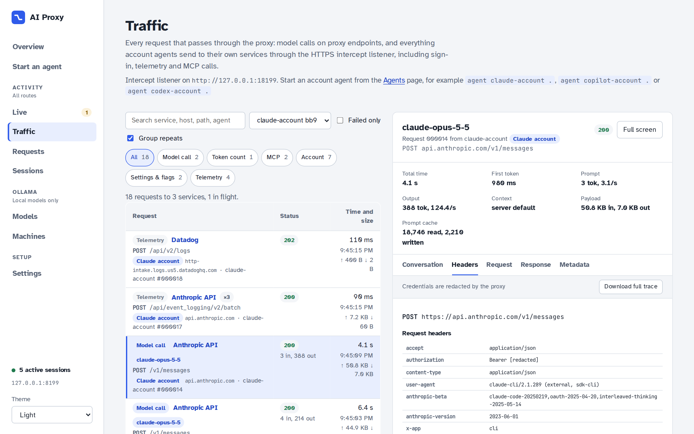

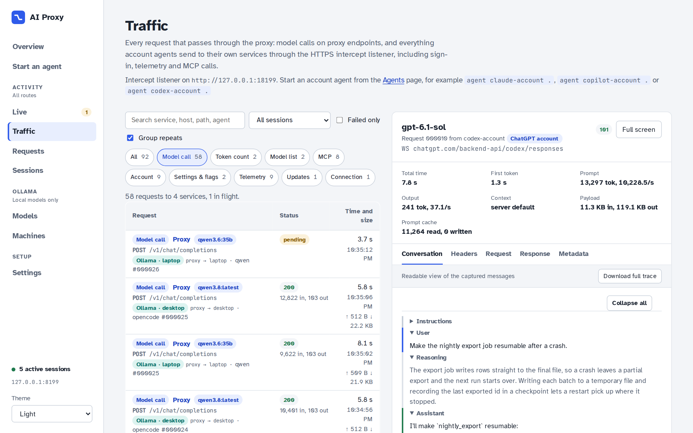

## The console

The console is served by the proxy at `http://127.0.0.1:8181`. The navigation is grouped by purpose: **Activity** pages cover every route, while the **Ollama** pages apply to local models only.

| Page | Shows |
|---|---|
| **Overview** | The routing map, a card per route with its totals, what's streaming, speed and the latest model calls. |
| **Start an agent** | Agents grouped by route, install state, launch commands, and manual setup. |
| **Live** | Model calls streaming token by token. |
| **Traffic** | Every request, like a browser's network tab. |
| **Requests** | Model-call history with search and filters, and an inspector. |
| **Sessions** | One row per agent run; expand for its requests and settings, or open it on its own page. |
| **Ollama models / machines** | What's on each Ollama machine, and its load. |
| **Settings** | Listen address, backends and their types. |

### Live

The **Live** page streams every in-flight model call token by token, with reasoning, the reply and tool calls in separate panes. Each card shows the phase (waiting, thinking, writing, calling tools), time to first token, a running token count and live tokens per second. It also shows what the agent asked for: endpoint, message and tool counts, the tools offered, system prompt size and, for local models, the Ollama settings applied. Open **Request, payload sent to Ollama and raw stream** for the conversation so far, the exact request, the translated payload, the latest 200 raw chunks and the headers.

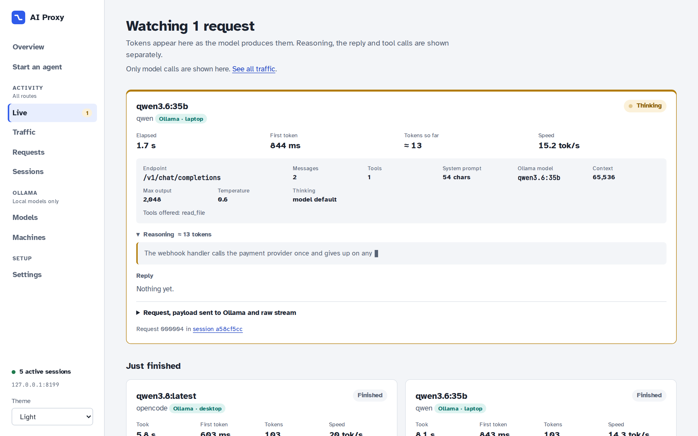

Live text is kept in memory only. Set `AI_PROXY_LIVE=0` to stream token counts without the text.

### Traffic

The **Traffic** page lists every request through the proxy, newest first, labelled with its service and type. The counts at the top filter by type; you can also filter by session, search, or show failures only. Back-to-back identical requests (agents poll some endpoints many times) fold into one row with a count. Select a request to see its timing, tokens, headers, bodies and conversation. See [What the requests are](#what-the-requests-are) for the screenshots.

### Requests

The **Requests** page is the model-call history. Search it and filter it by session, route, saved payloads or failures. Account agents' sign-in, telemetry and MCP calls are hidden by default, one checkbox away. The inspector shows time to first token, prompt and generation rates, context size, the conversation, the raw request and response and, for local models, the exact payload sent to Ollama.

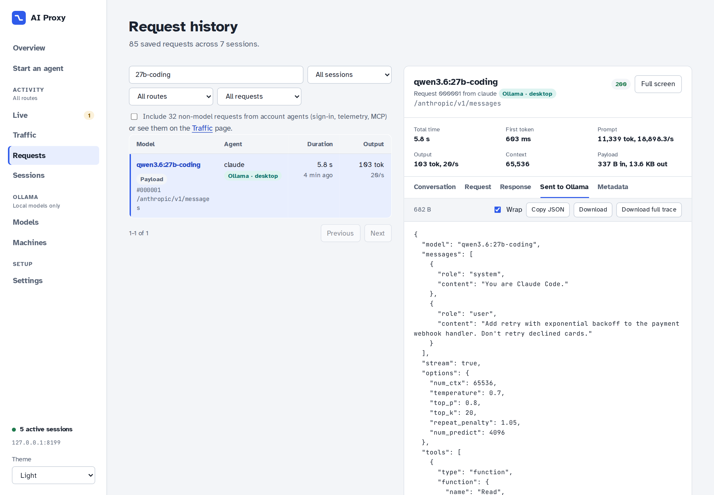

### Sessions

A session is one agent run; the launcher opens and closes one for you. **Sessions** lists them as collapsed rows with the agent, project, route, model, status, request count and last activity. Expand a row for its settings, actions (review, traffic, download JSONL, end, clear data, delete) and latest requests, or **Open** it on its own page.

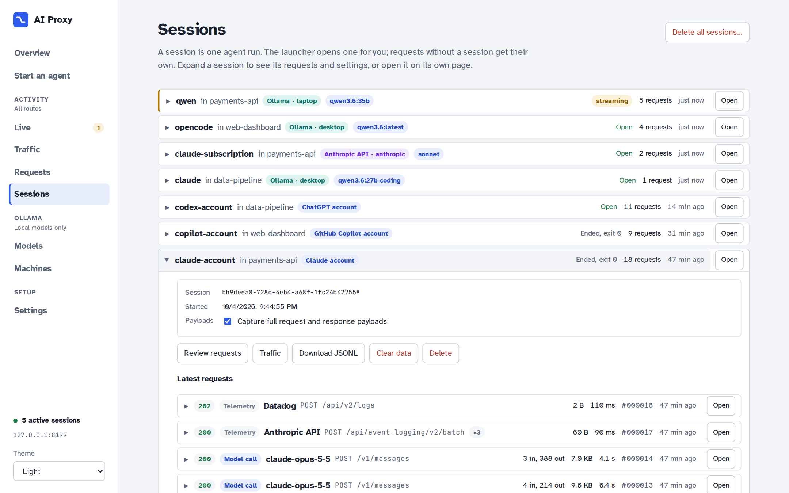

A session's own page lists its requests the same way, as one stable column. Each row expands in place, showing the streaming card while it's live and the full details once it finishes, or opens on its own page.

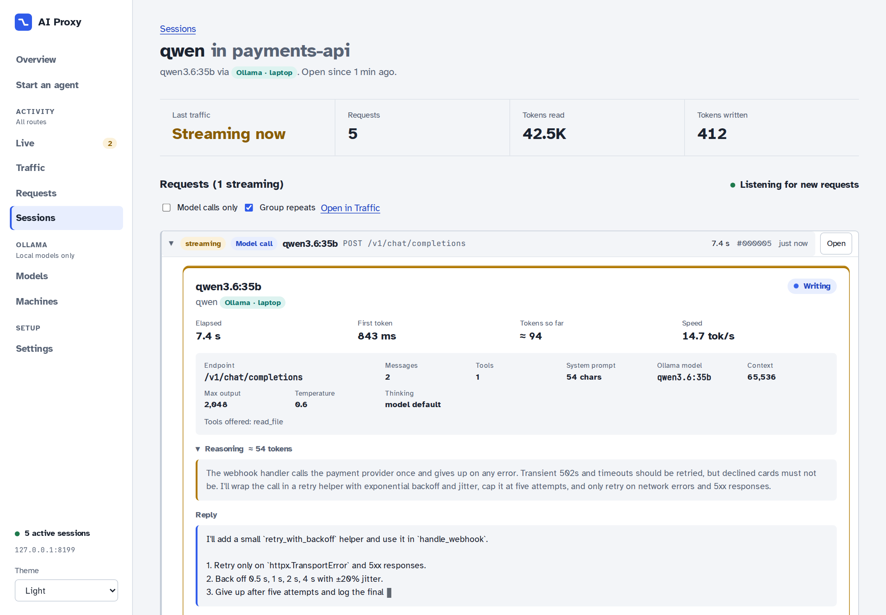

**Delete all sessions…** removes every saved request, telemetry file and payload. Sessions used in the last 15 minutes are emptied but kept, so agents that are still running keep working; sessions with a request in flight are skipped.

Saving full bodies is off unless you ask for it, because traces contain source code and possibly secrets. Turn it on with `--trace`, the capture switch on a session, or **Enable tracing** in the inspector. (The account agents' launch panel on **Start an agent** ticks it by default.) The console follows your system theme, or you can pick Light or Dark.

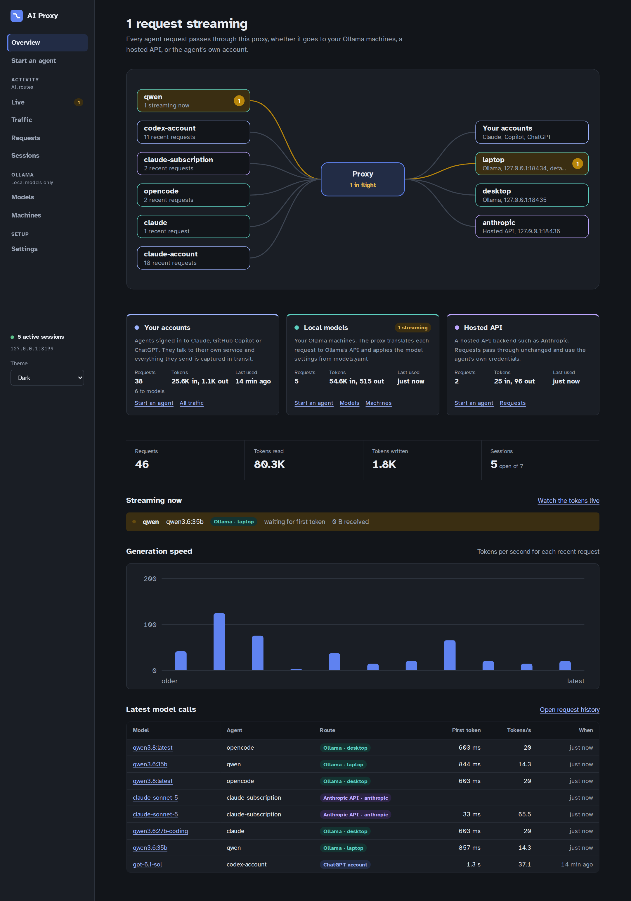

## Configuration

[`config/backends.yaml`](config/backends.yaml) holds the network settings. You can also edit them on **Settings**.

```yaml
proxy:
  listen_host: 127.0.0.1     # 0.0.0.0 to accept other machines
  listen_port: 8181
  url: http://127.0.0.1:8181 # address the launcher gives agents
default_backend: laptop
backends:
  laptop:    {type: ollama, url: http://localhost:11434}
  desktop:   {type: ollama, url: http://192.168.1.133:11434, metrics_url: http://192.168.1.133:8182}
  anthropic: {type: anthropic, url: https://api.anthropic.com}
intercept:                   # HTTPS listener for account agents
  enabled: true
  listen_host: 127.0.0.1     # keep on loopback
  listen_port: 8183
  passthrough: []            # host patterns tunnelled without decryption, e.g. ["*.internal.example"]
```

Backend types: `ollama` for local models (translated and tuned) and `anthropic` for the hosted pass-through. Account agents don't use a backend. Each agent's `backend_type` decides which backends it can use; when `--backend` is omitted, the launcher uses `default_backend` if it has the right type, otherwise the first backend that does.

Environment overrides:

| Variable | Overrides |
|---|---|
| `AI_PROXY_HOST`, `AI_PROXY_PORT`, `AI_PROXY_URL` | Listen address and the URL given to agents |
| `AI_PROXY_DEFAULT_BACKEND` | `default_backend` |
| `AI_PROXY_BACKENDS`, `AI_PROXY_MODELS`, `AI_PROXY_AGENTS` | Paths of the three config files |
| `AI_PROXY_LOG_DIR`, `AI_PROXY_UI_DIR`, `AI_PROXY_HOME` | Logs, built UI, repository root |
| `AI_PROXY_INTERCEPT` (0 disables), `AI_PROXY_INTERCEPT_HOST`, `AI_PROXY_INTERCEPT_PORT`, `AI_PROXY_CA_DIR` | Intercept listener and CA location |
| `AI_PROXY_LIVE` (0 hides live text), `AI_PROXY_UI_BUILD` (0 skips UI rebuilds) | Live view and UI build |

## API

Agent-facing endpoints, either per session or unscoped (unscoped requests get an implicit session, or set `X-AI-Proxy-Session`):

| Path | API |
|---|---|
| `http://<session>:x@127.0.0.1:8183` | HTTPS intercept proxy (`HTTPS_PROXY`) for account agents |
| `/session/{id}/v1/...` | OpenAI: chat completions (translated), responses, models, embeddings |
| `/session/{id}/anthropic/v1/messages` | Anthropic Messages and `count_tokens`; with a hosted `anthropic` backend, any other `/anthropic/...` path is forwarded too |
| `/session/{id}/api/...` | Native Ollama pass-through, with profiles applied to `chat` and `generate` |

Management API, used by the console and launcher (interactive docs at `/docs`):

| Endpoint | Purpose |
|---|---|
| `GET /api/status` | Totals, in-flight requests, recent requests, intercept state |
| `GET /api/requests[?session_id=]` | Full request history with payload availability |
| `POST /api/sessions`, `GET /api/sessions` | Open or list sessions |
| `PATCH /api/sessions/{id}` | End a session or toggle capture |
| `DELETE /api/sessions/{id}[/data]` | Delete a session, or only its saved data |
| `DELETE /api/sessions` | Delete all sessions (recently active ones are emptied and kept) |
| `GET /api/sessions/{id}/telemetry`, `.../traces/{request}` | JSONL telemetry and captured payloads |
| `GET /api/agents`, `POST /api/agents/{id}/sessions` | Agent registry; open a session and get its environment |
| `GET /api/models` | Models per backend with loaded state and applied profile |
| `GET /api/live[?session_id=]` | Server-sent events: snapshot, then start, delta and end events |
| `GET /api/live/{session}/{request}` | Payloads, headers and latest raw chunks for one live or recent request |
| `GET /api/hosts/{backend}`, `GET /api/host/metrics` | Loaded models and machine load for one backend; this machine's CPU, memory and GPU |
| `GET /api/config`, `PUT /api/config` | Network configuration |
| `GET /api/intercept`, `GET /api/intercept/ca.pem` | Intercept listener state, CA path and fingerprint; the CA certificate |

## Benchmarks

Add a folder under `benchmarks/tests` with `prompt.md` and `test.yaml`, then:

```bash
agent-benchmark reasoning --model qwen3.6:35b --backend desktop
agent-benchmark --all
```

Each run gets its own session. Results are written to `benchmarks/results/<timestamp>`.

## Development

```text
proxy/      Python service: FastAPI proxy, intercept listener, management API, agent launcher, benchmarks
ui/         Web console: React + TypeScript + Vite
config/     backends.yaml (network), models.yaml (Ollama tuning), agents.yaml (agent definitions)
benchmarks/ benchmark tests and results
scripts/    launcher shims, dev runner, Ollama start script, screenshot tooling
```

```bash
./scripts/dev.sh          # or .\scripts\dev.ps1: API with reload + Vite on :5173 (hot reload)
cd proxy && pytest        # proxy tests
cd ui && npm run typecheck
```

Logs and traces are stored under `logs/`:

```text
logs/
├── proxy/proxy.log
└── sessions/<session-id>/
    ├── session.json
    ├── requests.jsonl
    └── traces/000001.json
```

The screenshots come from a self-contained demo: fake Ollama machines and a fake Anthropic API, account sessions shaped like real captures but with made-up content, and real traffic streaming through a proxy on port 8199. None of it touches your logs, config or accounts.

```bash
python scripts/screenshots/demo.py                                    # leave running
node scripts/screenshots/capture.mjs http://127.0.0.1:8199 docs/screenshots
```
